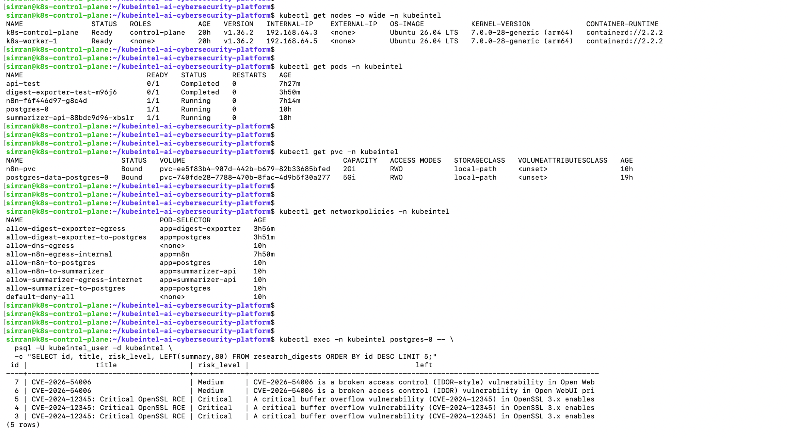
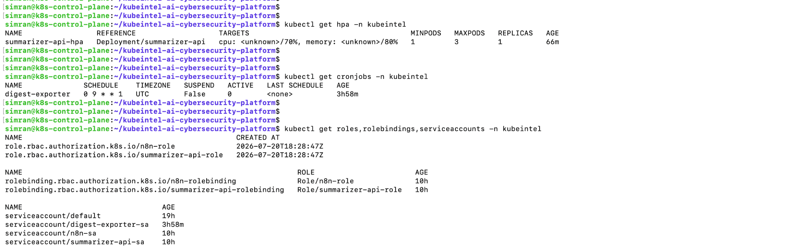
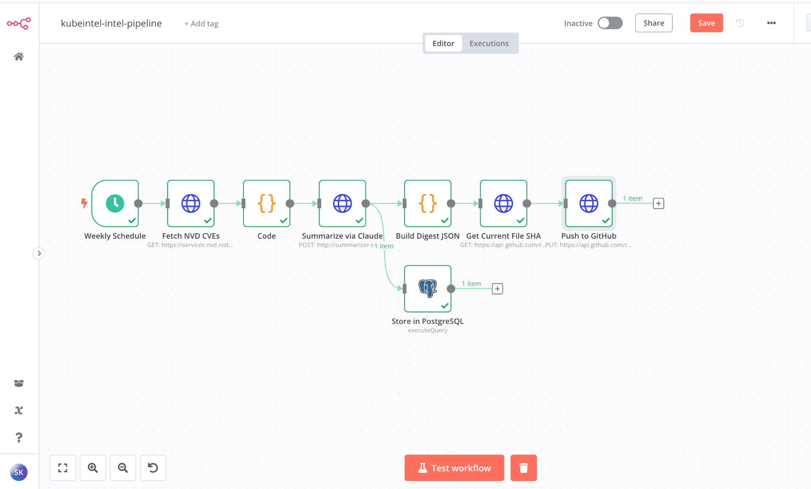
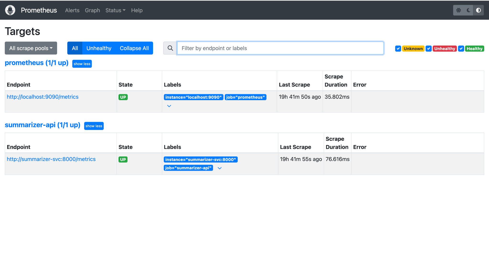
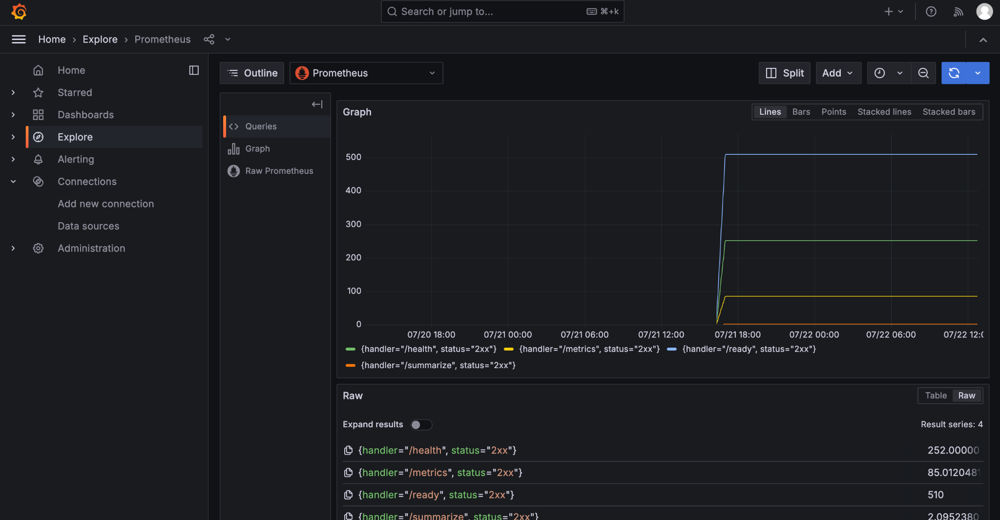

# KubeIntel — AI & Cybersecurity Research Digest Platform

A self-managed Kubernetes platform that runs an AI-powered cybersecurity research digest workflow. The system collects security and AI research, summarises it using the Claude API, stores results in PostgreSQL, and publishes a weekly digest to GitHub — automatically updating a live portfolio feed.

Built to demonstrate production-style Kubernetes administration, DevSecOps practices, and platform engineering on a bare-metal kubeadm cluster.

---

## Architecture

```
n8n Workflow Engine
        │
        ▼
summarizer-api (FastAPI + Claude API)
        │
        ▼
PostgreSQL (StatefulSet + PVC)
        │
        ▼
digest-exporter CronJob → kubeintel-digests (GitHub) → cyberwithsimran.com
```

All workloads run in the `kubeintel` namespace with default-deny NetworkPolicies and explicit allow rules per communication path.

---

## Cluster Environment

| Component          | Detail                              |
|--------------------|-------------------------------------|
| Platform           | MacBook Pro M1 — UTM hypervisor     |
| OS                 | Ubuntu 26.04 LTS ARM64              |
| Kubernetes         | v1.36.2                             |
| Container Runtime  | containerd                          |
| CNI                | Calico (pod CIDR: 10.244.0.0/16)   |
| Nodes              | 1 control-plane + 1 worker          |
| Storage            | local-path provisioner (default)    |

---

## What's Built

### Workloads

| Component         | Kind          | Notes |
|-------------------|---------------|-------|
| postgres          | StatefulSet   | PostgreSQL 16, 5Gi PVC, init SQL schema |
| summarizer-api    | Deployment    | FastAPI + Claude API (claude-opus-4-8), structured JSON logging, pydantic-settings |
| n8n               | Deployment    | Workflow engine, 2Gi PVC, postgres-backed storage, init container |
| digest-exporter   | CronJob       | Runs weekly (Mon 09:00 UTC), reads postgres, pushes digest.json to GitHub |

### Security

| Resource                   | Detail |
|----------------------------|--------|
| NetworkPolicies (10)       | default-deny-all + explicit allow per path |
| ServiceAccounts (3)        | One per workload, `automountServiceAccountToken: false` |
| Roles + RoleBindings (2)   | Namespace-scoped, least-privilege (own ConfigMap + Secret only) |
| Pod security contexts      | `runAsNonRoot`, `readOnlyRootFilesystem`, `drop: ALL` capabilities |
| Secret management          | `stringData` with placeholder values — real values injected at apply time, never committed |
| Container images           | Multi-stage Alpine Dockerfiles, non-root user (uid 1000), pinned tags |

### Repository Structure

```
kubeintel-ai-cybersecurity-platform/
├── docs/                        # cluster-setup, troubleshooting, architecture, security-design
├── digest-exporter/             # Python CronJob — postgres → GitHub
│   ├── exporter.py
│   ├── Dockerfile
│   └── requirements.txt
├── summarizer-api/              # FastAPI service — LLM summarization
│   ├── app/
│   │   ├── main.py
│   │   ├── config.py            # pydantic-settings typed config
│   │   ├── summarizer.py        # Claude API call, asyncio.to_thread
│   │   ├── models.py
│   │   └── logging_config.py   # structured JSON logging
│   ├── Dockerfile
│   └── requirements.txt
├── k8s/
│   ├── 00-namespace/
│   ├── 01-postgres/             # StatefulSet, headless Service, ConfigMap, Secret, init SQL
│   ├── 02-summarizer-api/       # Deployment, Service, ConfigMap, Secret
│   ├── 03-n8n/                  # Deployment, Service, PVC, ConfigMap, Secret
│   ├── 04-networking/           # 10 NetworkPolicy manifests
│   ├── 05-rbac/                 # ServiceAccounts, Roles, RoleBindings
│   ├── 06-digest-exporter/      # CronJob, ConfigMap, Secret, ServiceAccount
│   └── 07-crds/                 # (reserved for cert-manager, Argo CD, Prometheus Operator)
├── workflows/n8n/               # n8n workflow JSON — version-controlled
├── scripts/
│   └── push-workflow.sh         # pushes workflow JSON to n8n via API
└── screenshots/                 # cluster validation screenshots
```

---

## Applying Manifests

```bash
kubectl apply -f k8s/00-namespace/
kubectl apply -f k8s/01-postgres/
kubectl apply -f k8s/02-summarizer-api/
kubectl apply -f k8s/03-n8n/
kubectl apply -f k8s/04-networking/
kubectl apply -f k8s/05-rbac/
kubectl apply -f k8s/06-digest-exporter/
```

Verify:

```bash
kubectl get all -n kubeintel
kubectl get pvc -n kubeintel
kubectl get networkpolicies -n kubeintel
kubectl get cronjobs -n kubeintel
```

---

## Kubernetes Concepts Demonstrated

- kubeadm cluster bootstrap from scratch
- containerd runtime configuration
- Calico CNI with custom pod CIDR
- Deployments, StatefulSets, CronJobs
- PersistentVolumeClaims (ReadWriteOnce)
- Headless and ClusterIP Services
- ConfigMaps + Secrets (envFrom + valueFrom)
- NetworkPolicies (default-deny + allowlist)
- RBAC: ServiceAccounts, Roles, RoleBindings
- Pod security contexts + container security contexts
- Readiness and liveness probes (httpGet + exec)
- Resource requests and limits
- imagePullSecrets (GHCR private registry)
- Init containers (postgres readiness check)
- Multi-stage Dockerfiles (Alpine, non-root)
- Recreate deployment strategy (PVC-backed workload)
- CronJob with concurrencyPolicy and backoffLimit

---

## Security Design

See [docs/security-design.md](docs/security-design.md) for full details.

- Default-deny NetworkPolicy blocks all traffic in the namespace
- Each component has explicit egress and ingress allow rules per communication path
- Secrets never committed — placeholder values only in Git
- GitHub token stored in Kubernetes Secret, not in workflow engine
- All containers run as non-root with read-only filesystem and all capabilities dropped
- seccompProfile: RuntimeDefault on every pod
- Pod Security Admission enforced at `restricted` level on the kubeintel namespace
- Per-component ServiceAccounts with namespace-scoped least-privilege Roles

---

## Project Status

### Level 1 — CKA Core ✅
- [x] kubeadm cluster (bare-metal ARM64, containerd, Calico)
- [x] PostgreSQL StatefulSet + PVC
- [x] Application Deployments (summarizer-api, n8n, digest-exporter CronJob)
- [x] Services (ClusterIP, headless)
- [x] ConfigMaps + Secrets
- [x] NetworkPolicies (default-deny + 11 allow rules)
- [x] RBAC (per-component ServiceAccounts, least-privilege Roles)
- [x] Probes (readiness, liveness, startupProbe)
- [x] Resource requests + limits on all containers
- [x] CronJob (digest-exporter, weekly)
- [x] Kustomize (base + dev/prod overlays)
- [x] ResourceQuota + LimitRange
- [x] PodDisruptionBudget
- [x] HPA (CPU + memory, 1–3 replicas)

### Level 2 — Production Hardening ✅
- [x] metrics-server
- [x] Prometheus
- [x] Grafana (auto-provisioned datasource)
- [x] Pod Security Admission (restricted enforcement on kubeintel namespace)
- [x] seccompProfile: RuntimeDefault on all workloads
- [x] readOnlyRootFilesystem on all containers
- [x] init containers with resource limits

### Level 3 — CRD Extensions ✅
- [x] Nginx Ingress Controller (NodePort, bare-metal)
- [x] cert-manager (ClusterIssuer + Certificate, TLS for n8n)
- [x] Argo CD Application CRD (GitOps sync from this repo)

### Next
- [ ] CI/CD pipeline (GitHub Actions: build, Trivy scan, push, kubeconform)
- [ ] Custom Prometheus metrics (kubeintel_summarization_success_total etc.)
- [ ] PostgreSQL backup CronJob
- [ ] Falco runtime security
- [ ] External Secrets Operator

---

## Screenshots

### Cluster — nodes, pods, PVCs, NetworkPolicies, PostgreSQL data


### HPA, CronJob, RBAC


### n8n intel pipeline — all nodes green


### Prometheus targets — prometheus and summarizer-api both UP


### Grafana Explore — /summarize 2xx confirms end-to-end AI summarization


